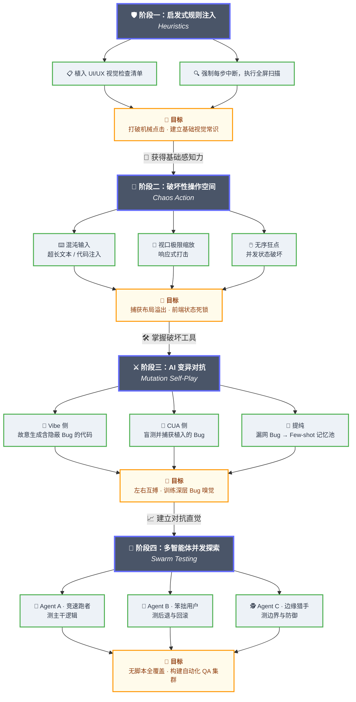

# CUA 视觉智能体：找 Bug 能力四阶进化路径

```mermaid
graph TD
    %% ===== 阶段一 =====
    S1["<b>🛡️ 阶段一：启发式规则注入</b><br/><i>Heuristics</i>"]
    A1["📋 植入 UI/UX 视觉检查清单"]
    A2["🔍 强制每步中断，执行全屏扫描"]
    G1["🎯 <b>目标</b><br/>打破机械点击 · 建立基础视觉常识"]

    S1 --> A1
    S1 --> A2
    A1 --> G1
    A2 --> G1

    %% ===== 过渡 =====
    G1 -->|"🧠 获得基础感知力"| S2

    %% ===== 阶段二 =====
    S2["<b>🔨 阶段二：破坏性操作空间</b><br/><i>Chaos Action</i>"]
    B1["⌨️ 混沌输入<br/>超长文本 / 代码注入"]
    B2["📏 视口极限缩放<br/>响应式打击"]
    B3["🖱️ 无序狂点<br/>并发状态破坏"]
    G2["🎯 <b>目标</b><br/>捕获布局溢出 · 前端状态死锁"]

    S2 --> B1
    S2 --> B2
    S2 --> B3
    B1 --> G2
    B2 --> G2
    B3 --> G2

    %% ===== 过渡 =====
    G2 -->|"🛠️ 掌握破坏工具"| S3

    %% ===== 阶段三 =====
    S3["<b>⚔️ 阶段三：AI 变异对抗</b><br/><i>Mutation Self-Play</i>"]
    C1["🔴 Vibe 侧<br/>故意生成含隐蔽 Bug 的代码"]
    C2["🔵 CUA 侧<br/>盲测并捕获植入的 Bug"]
    C3["🔄 提纯<br/>漏网 Bug → Few-shot 记忆池"]
    G3["🎯 <b>目标</b><br/>左右互搏 · 训练深层 Bug 嗅觉"]

    S3 --> C1
    S3 --> C2
    S3 --> C3
    C1 --> G3
    C2 --> G3
    C3 --> G3

    %% ===== 过渡 =====
    G3 -->|"📈 建立对抗直觉"| S4

    %% ===== 阶段四 =====
    S4["<b>🤖 阶段四：多智能体并发探索</b><br/><i>Swarm Testing</i>"]
    D1["🏃 Agent A · 竞速跑者<br/>测主干逻辑"]
    D2["🥴 Agent B · 笨拙用户<br/>测后退与回滚"]
    D3["🕵️ Agent C · 边缘猎手<br/>测边界与防御"]
    G4["🎯 <b>目标</b><br/>无脚本全覆盖 · 构建自动化 QA 集群"]

    S4 --> D1
    S4 --> D2
    S4 --> D3
    D1 --> G4
    D2 --> G4
    D3 --> G4

    %% ===== 样式定义 =====
    classDef stage fill:#4a5568,stroke:#646cff,stroke-width:3px,color:#fff,font-size:15px
    classDef action fill:#edf2f7,stroke:#4caf50,stroke-width:2px,color:#2d3748,font-size:13px
    classDef goal fill:#fffbeb,stroke:#ff9800,stroke-width:2px,color:#92400e,font-size:13px

    class S1,S2,S3,S4 stage
    class A1,A2,B1,B2,B3,C1,C2,C3,D1,D2,D3 action
    class G1,G2,G3,G4 goal
```
